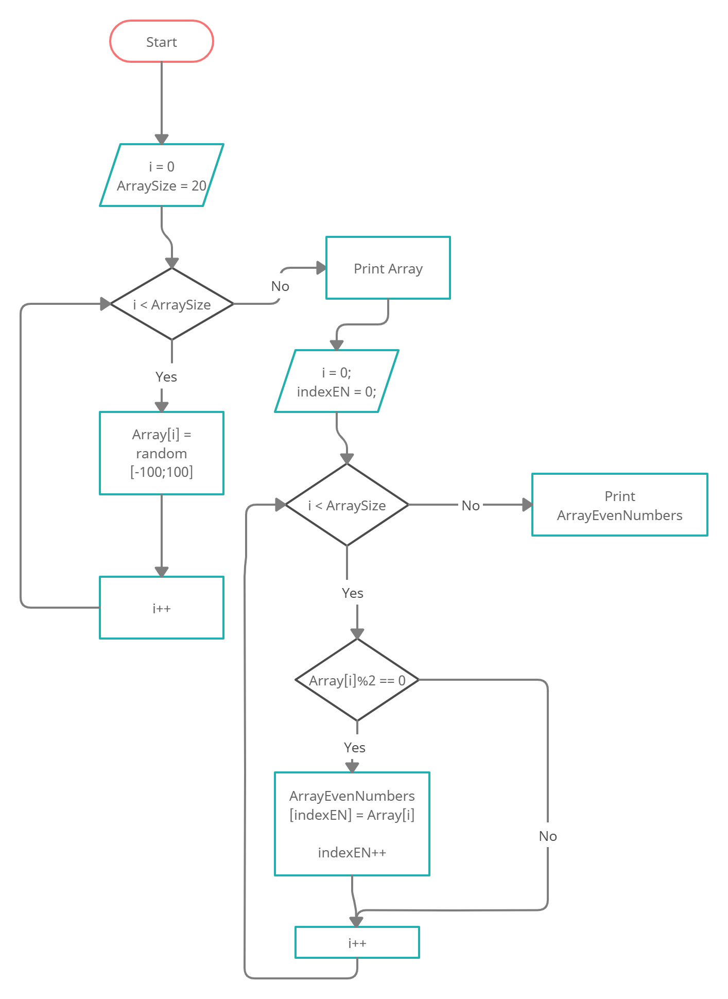

# Описание решения финально задачи

## _Задача:_

Написать программу, которая из имеющегося массива целых чисел формирует массив из четных чисел.
Первоначальный массив можно ввести с клавиатуры, либо сгенерировать случайным образом. При решении не
рекомендуется пользоваться коллекциями, лучше обойтись исключительно массивами.

## _Решение:_

1. Формируем массив случайных целых чисел (берем 20 чисел) в интервале от -100 до 99.
2. Выводим в консоль получившийся массив. Для этого используем метод, который записывает элементы массива в текстовую строку.
3. Находим количество четных чисел получившегося массива (для задания размера нового массива).
4. Формируем новый массив, который включает в себя только четные числа первого массива.
5. Выводим в консоль получившийся массив четных чисел используя метод печати массива.

## _Алгоритм решения:_

## **Описание используемых в программе методов:**

### **FillArray(int[] Array)**

Метод заполняет принимаемый массив целочисленными значениями от -100 до 99.

### **PrintArray(int[] Array)**

Метод формирует из элементов принимаемого массива текстовую строку разделяя их пробелами.

### **ArrayEvenNumbers(int[] Array)**

Метод создает массив заполненный только четными значениями входящего массива.
